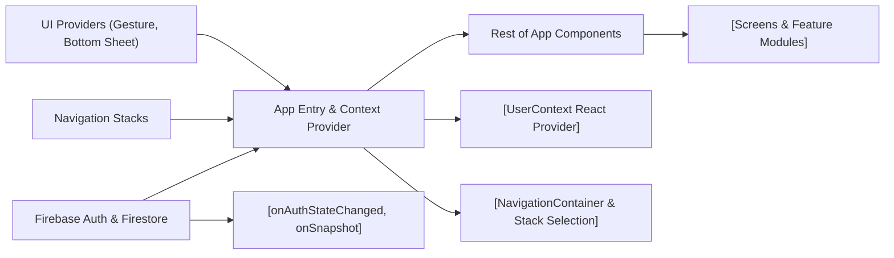

# App Entry Point and Core Context Provider

## Overview
The main entry module (`App.tsx`) initializes and orchestrates navigation, user authentication context, and global providers for the MyColoc mobile application. It determines which main application stack to render based on the user's authentication state and their co-location (coloc) membership, serving as the root integration point between the authentication system, navigation stacks, and the global user context.

## Key Features

- **Authentication State Management**: Listens to Firebase Authentication and updates user state reactively across the app.
- **User Context Provider**: Exposes real-time user profile data from Firestore via React Context, enabling any component to access up-to-date user information.
- **Navigation Routing**: Dynamically renders one of the three core navigation stacks:
  - **RootStack**: for authenticated users who belong to a coloc (shared home/group).
  - **NoColocStack**: for authenticated users not currently in a coloc.
  - **AuthStack**: for unauthenticated users.
- **Integration of Global UI Providers**: Wraps the app with providers for gesture handling and bottom sheets to ensure cross-stack UI consistency and interaction.

## System Errors

- **Authentication Loss**:  
  - **Description**: If user authentication is lost (e.g., sign out or session expiry), the app automatically reroutes to the AuthStack.
  - **Resolution**: Re-authenticate via the provided UI.

- **User Data Not Found**:  
  - **Description**: If the user document cannot be fetched from Firestore (e.g., no such document), user state resets and the interface reflects the unauthenticated or non-coloc state.
  - **Resolution**: Ensure user registration is complete in Firebase Firestore.

- **Provider Context Missing**:  
  - **Description**: If components attempt to consume `UserContext` outside this module's provider tree, context will be undefined.
  - **Resolution**: Only use `UserContext` within descendant components of `App.tsx`.

## Usage Examples

```jsx
// App.tsx acts as the sole required entry point—no instantiation needed by consumers.

import React from 'react';
import { AppRegistry } from 'react-native';
import App from './App';

AppRegistry.registerComponent('main', () => App);

// Accessing user info anywhere within the tree:
import { useContext } from 'react';
import { UserContext } from './UserContext';

function MyComponent() {
  const [userInfo] = useContext(UserContext);

  if (userInfo) {
    return <Text>Welcome, {userInfo.displayName}</Text>;
  } else {
    return <Text>Please log in</Text>;
  }
}
```

## System Integration



**Legend:**  
- **App Entry & Context Provider** = `App.tsx`
- **Rest of App Components** = all child components/screens consuming navigation & context  
- **Firebase Auth & Firestore** = external authentication and profile source  
- **Navigation Stacks** = AuthStack, NoColocStack, RootStack  
- **UI Providers** = global UI context for gestures and bottom sheets

**Purpose:**  
This module is crucial as it mediates user authentication, global context, and navigation. High-level features and children depend on its correct operation for seamless user experience and permissions management throughout the application.