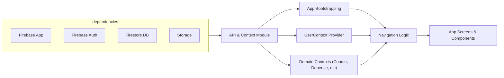

# API & Context Overview

## Overview
This module sets up the core API and user context for the MyColoc app, providing integration with Firebase services (authentication, Firestore database, and storage) and managing user state throughout the application. It acts as the central gateway for other modules to access authentication status, user data, and persistent backend resources.

## Key Features
- **Firebase Initialization**: The module initializes Firebase with your project credentials, making primary services (Auth, Firestore, Storage) readily available for app-wide usage.
- **Authentication State Handling**: Listens for authentication state changes, making the current user's UID accessible throughout the app, and automatically updates the user context accordingly.
- **User Data Context**: Provides a global React context for user information, ensuring that components reactively update when user data in Firestore changes.
- **Context Providers**: Supplies additional contexts (Course, Depense, Coloc, AuPlusProche, RemboursementLoading) for managing domain-specific state across the app.
- **Conditional Navigation**: Directs app flow (AuthStack, NoColocStack, RootStack) based on the user's authentication status and if they belong to a colocation.

## System Errors
- **Authentication Failure**:  
  When Firebase authentication fails (network error, invalid credentials), users may not be able to log in or their state won't update.  
  *Resolution*: Check network connection and ensure valid credentials or OAuth setup.

- **Permission Denied (Firestore/Storage)**:  
  If Firestore or Storage security rules deny access, data fetches or uploads will fail.  
  *Resolution*: Update Firebase security rules to allow authenticated access as required by the app.

- **Stale or Missing User Data**:  
  If the expected user document in Firestore is missing or corrupted, the app may act as if the user is not fully set up, potentially sending them repeatedly to setup screens.  
  *Resolution*: Make sure user registration also writes a user document, and handle null data gracefully in UI.

## Usage Examples

```tsx
// Access Firebase Auth and Firestore directly
import { FB_AUTH, FB_DB } from './firebaseconfig';
import { signInWithEmailAndPassword } from "firebase/auth";
import { doc, getDoc } from "firebase/firestore";

// Login function
async function login(email, password) {
  await signInWithEmailAndPassword(FB_AUTH, email, password);
}

// Reading user profile in a component
import React, { useContext } from 'react';
import { UserContext } from './UserContext';

function UserProfile() {
  const [userInfo] = useContext(UserContext);

  if (!userInfo) return <Text>Loading...</Text>;
  return <Text>Welcome, {userInfo.displayName}!</Text>;
}

// Consuming context-provided loading state
import { RemboursementLoadingContext } from './UserContext';
const { loading, setLoading } = useContext(RemboursementLoadingContext);
```

## System Integration


