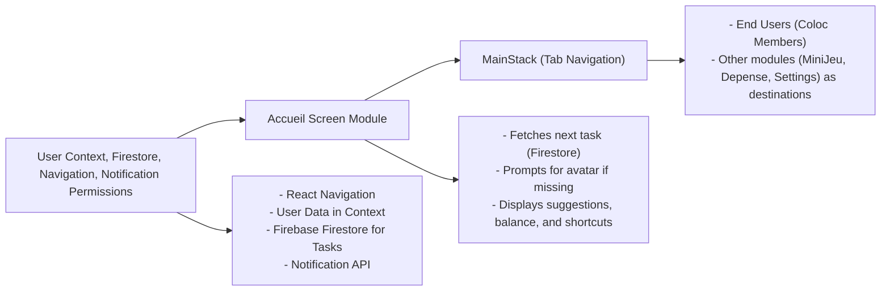

# Accueil Screen Module

## Overview
The **Accueil Screen** module serves as the home dashboard for users after authentication and colocation (shared housing group) association. It acts as the entry point to the main features of the application, bringing together user-specific summaries, upcoming tasks, suggestions, and main navigation actions. Its role is to provide a quick overview and essential shortcuts for daily usage inside a colocation environment.

## Key Features

- **Quick Access to Main Features**: Centralizes navigation to expense management, group mini-games, and upcoming tasks from a single dashboard.
- **Task Reminder and Display**: Highlights the next household task assigned to the user, visually and interactively, promoting proactive completion (through components like `TacheCard` and `TacheCardEmpty`).
- **Personalization and Reminders**: Detects if critical user profile details (such as avatar) are missing and prompts for completion, ensuring a personalized experience.
- **Notifications Permission Prompt**: Triggers notification permission checks for relevant system reminders and alerts.
- **Monthly Suggestions and Highlights**: Displays recommended content (“La sélection du mois”) and suggestions tailored to coloc life.
- **Integrated Account Overview**: Features direct access to the user's current balance and expense tracker via the "Mon Solde" component.
- **Mini-Game Entrypoint**: Presents a shortcut to group mini-games, fostering community engagement within the colocation.
- **User Context Awareness**: Dynamically adjusts what is shown based on live context information (user state, next task, etc).

## System Errors

- **Missing Avatar Alert**:  
  - **Description**: If the user's avatar is not set, an alert is shown prompting the user to select one before continuing.
  - **Resolution**: The alert immediately redirects the user to the avatar selection page in Settings, preventing further navigation until resolved.

- **Task Retrieval Failure**:
  - **Description**: If there is no upcoming task assigned or a problem fetching tasks, the interface displays a placeholder message stating that the user is not next on any task.
  - **Resolution**: There is no blocking here; the user continues to use the dashboard, but may be advised to check colocation setup or contact support in case the problem persists.

- **Permission Denial (Notifications)**:
  - **Description**: If the user denies notification permissions, reminders and alerts may not be received.
  - **Resolution**: User can enable notifications later via device settings; recommend surfacing this in the app's onboarding or help section.

## Usage Examples

```tsx
// The AccueilScreen is typically rendered as the home screen after authentication and coloc selection

import AccueilScreen from 'screens/Accueil';

// Inside a navigation stack:
<Stack.Screen name="Accueil" component={AccueilScreen} />

// Example navigation from another component
navigation.navigate('Accueil');

// The screen will display the next assigned task, personalized suggestions,
// allow access to mini-games, and prompt for profile completion if needed.
```

## System Integration


