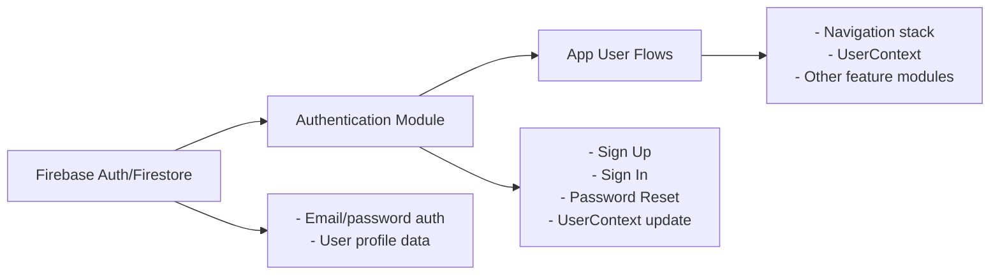

# Authentication Module

## Overview
The Authentication module manages user onboarding and access control within the application. It facilitates user registration, login, and password reset flows, leveraging Firebase Authentication as the backend service. This ensures secure sign-in, user identification, and session management, forming the entry point for user-specific features and data in the system.

## Key Features
- **User Registration (Sign-Up):**  
  Allows new users to create accounts using email, password, and a username. On successful registration, user data is persisted in Firestore for subsequent profile management and personalized experiences.
- **User Login (Sign-In):**  
  Enables returning users to access their accounts securely with email/password credentials. Handles feedback for authentication success and common errors.
- **Password Reset:**  
  Provides an in-app workflow for users to request password reset emails, directly integrating with Firebase Authentication’s secure password management.
- **Session Handling:**  
  Integrates with the app’s UserContext to manage and propagate user state across the application after authentication operations.
- **Error Feedback:**  
  Delivers user-friendly messages in response to typical authentication issues, enhancing usability and troubleshooting.

## System Errors
- **Invalid Credentials:**  
  Triggered when the user provides an incorrect password or non-existent email.  
  _Resolution:_ Prompt users to check their credentials; provide specific error messages for wrong password or unregistered email.
- **Weak Password:**  
  Occurs if the password during sign-up is below minimum criteria (e.g., fewer than 6 characters).  
  _Resolution:_ Instruct users to choose a stronger password (minimum 6 characters).
- **Invalid Email Format:**  
  Detected when the email does not match standard format requirements.  
  _Resolution:_ Guide users to enter a valid email address.
- **Password Reset Request with Missing/Invalid Email:**  
  Raised when attempting password reset without specifying an email, or with an invalid email.  
  _Resolution:_ Require a correctly formatted email to proceed with reset.
- **Network/Firestore Errors:**  
  Shown in case of backend or network connectivity issues during authentication or Firestore writes.  
  _Resolution:_ Advise retrying and check internet connectivity; display the error message for further diagnosis.

## Usage Examples

```javascript
// Sign Up a new user
import { createUserWithEmailAndPassword } from 'firebase/auth';
import { setDoc, doc } from 'firebase/firestore';
import { FB_AUTH, FB_DB } from './firebaseconfig';

async function signUpUser(email, password, username) {
  // Firebase Auth registration
  const userCred = await createUserWithEmailAndPassword(FB_AUTH, email, password);
  // Create Firestore entry
  await setDoc(doc(FB_DB, 'Users', userCred.user.uid), {
    nom: username,
    uuid: userCred.user.uid,
    solde: 0,
    colocID: "0",
    membersID: [],
    avatarUrl: '',
  });
}

// Sign In existing user
import { signInWithEmailAndPassword } from 'firebase/auth';
import { FB_AUTH } from './firebaseconfig';

async function loginUser(email, password) {
  await signInWithEmailAndPassword(FB_AUTH, email, password);
}

// Send Password Reset Email
import { sendPasswordResetEmail } from 'firebase/auth';
import { FB_AUTH } from './firebaseconfig';

async function resetPassword(email) {
  await sendPasswordResetEmail(FB_AUTH, email);
}
```

## System Integration


