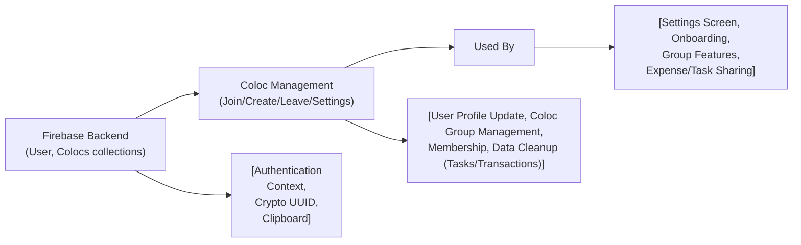

# Coloc Management

## Overview
The Coloc Management feature enables users to join, create, and manage shared accommodations (“colocations”) within the app. It provides all household members the ability to view other members, update personal settings (such as avatar or contact information), and perform essential actions like joining, leaving, or switching colocations. This module centralizes colocation lifecycle and user membership actions, acting as the foundation for shared expense tracking, task management, and group notifications across the app.

## Key Features
- **Create Colocation**: Allows a user to generate a new colocation group with a unique code that others can join. This is the starting point for collaborative features within the app.
- **Join Colocation**: Lets existing users join a colocation by entering a shared code, updating membership details for both the user and the selected colocation.
- **Leave Colocation**: Users can opt to leave a colocation. All personal data related to the colocation (e.g., tasks, transactions) are purged from shared records, and membership entries are updated system-wide.
- **View Coloc Members**: Shows a list of all current members, including their avatars, within the colocation.
- **Settings Management**: Provides easy access to configure profile avatar, retrieve the colocation code, and get support contact details.
- **Clipboard Sharing**: Enables users to copy the colocation code or support contact to the device’s clipboard for easy sharing or communication.

## System Errors
- **Invalid Coloc Code**:  
  *Description*: Attempting to join a colocation using a code that does not exist.  
  *Resolution*: Informs the user with an alert (‘Ce code n'existe pas !’) and prompts to re-enter the code.
- **Network/Backend Error During Leave/Join/Create Operation**:  
  *Description*: Issues with updating or retrieving data from Firebase during membership changes.  
  *Resolution*: Notifies user with a generic connection error prompt. Advise the user to check their connectivity and retry.
- **Redundant Coloc Code Generation**:  
  *Description*: On rare occasions, newly generated coloc codes may collide with existing ones.  
  *Resolution*: The system automatically regenerates a new code until a unique one is found, with no impact on user experience.

## Usage Examples

```javascript
// Create a new colocation
await handleCreateColoc();
// User is now a member of a new colocation

// Join an existing colocation by code
await handleJoinColoc();
// If the code is valid, user is added to the group

// Leave current colocation
await handleLeaveColocSetup();
// Follows step-by-step confirmation, then removes user data from the colocation

// Copy colocation code to clipboard for sharing
await Clipboard.setStringAsync(user.colocID); // Copies the code for sharing with a new member

// List all coloc members (as rendered in settings)
<FlatList
  data={members} // Array of {id, name, photo}
  renderItem={renderMember}
  keyExtractor={item => item.id}
/>
```

## System Integration


