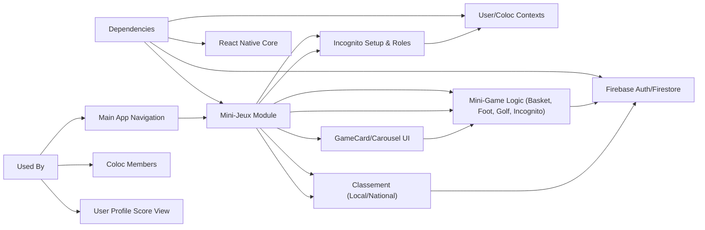

# Mini-Jeux Module

## Overview
The Mini-Jeux module enables users to access, play, and compete in various mini-games within the MyColoc application. It provides a comprehensive platform for group members to track scores, view leaderboards (both local and national), and interact through recreational gameplay. This module is central for community engagement, gamification, and fostering friendly competition among colocataires.

## Key Features

- **Game Hub & Carousel**: Presents a carousel of available mini-games (e.g., BasketBall, FootBall, Golf, Incognito), allowing users to navigate to game screens or launch games directly.
- **Individual Game Launch & Play**: Each mini-game (BasketBall, FootBall, Golf, Incognito) provides an interactive gameplay interface, tailored to mobile gestures (swipe, tap, drag), integrated within the app ecosystem.
- **Score Tracking**: Automates the recording and updating of the best personal scores for each game type, both at user and coloc (household) level.
- **Classement (Leaderboard) Display**: Shows real-time leaderboards at both local (within coloc) and national (all colocs) scope, ranking by cumulative or per-game scores.
- **GameCard Interaction**: Custom cards display each user's progress and allow launching games or viewing rankings.
- **Incognito Game Setup**: Provides a setup experience for the "Incognito" social deduction game, including player selection, rule explanation, and automated role/word assignment.
- **Score Synchronization**: Ensures that scores and rankings update in Firebase backend, reflecting personal and coloc results across devices and for national graphs.
- **User Feedback & Gamification**: Engages users through intuitive score indicators, real-time results, and visual cues (animations, gradients, avatars).

## System Errors

- **Score Not Updating**: 
  - **Description**: After finishing a game, the best score does not reflect the recent performance.
  - **Resolution**: Ensure stable internet connectivity; scores are stored in Firebase, so changes require a network round-trip. User session must be valid.
- **Leaderboard Not Loading**:
  - **Description**: Either local or national leaderboard fails to display, or shows stale data.
  - **Resolution**: Check for network errors. This feature relies on retrieving documents from Firebase. Retrying may help.
- **Minimum Players Not Met (Incognito)**:
  - **Description**: Attempting to start Incognito with fewer than three players leads to a blocking alert.
  - **Resolution**: Add at least three players to proceed.
- **Game Session Not Starting**:
  - **Description**: Unable to launch a mini-game, or controls are unresponsive.
  - **Resolution**: Ensure required permissions are set, and the App/OS supports necessary touch/gesture features.

## Usage Examples

```jsx
// Accessing and displaying the Mini-Jeux carousel (in MiniJeu.tsx)
<SafeAreaView>
  <Carrousel gameCardData={gameCardData} />
</SafeAreaView>

// Launching a specific game (e.g., Basket)
navigation.navigate('Basket');

// Viewing rankings from a GameCard
<TouchableOpacity onPress={() => navigation.navigate('ClassementBasketBall')}>
  <Score score={user.basketBestScore} color="white" />
</TouchableOpacity>

// Setting up a new Incognito game with player selection and rule display
<PlayersCard
  selectedPlayers={selectedPlayers}
  setSelectedPlayers={setSelectedPlayers}
  onPress={() => {
    selectedPlayers.length <= 2
      ? Alert.alert("Il manque des joueurs", "Sélectionne au moins trois joueurs !")
      : assignRoles();
  }}
/>
<Regles regles="[Game rules string]" />

// Switching leaderboard tabs (local vs national)
<TouchableOpacity onPress={() => handleTabPress(1)}>
  <Text>Classement national</Text>
</TouchableOpacity>
```

## System Integration


