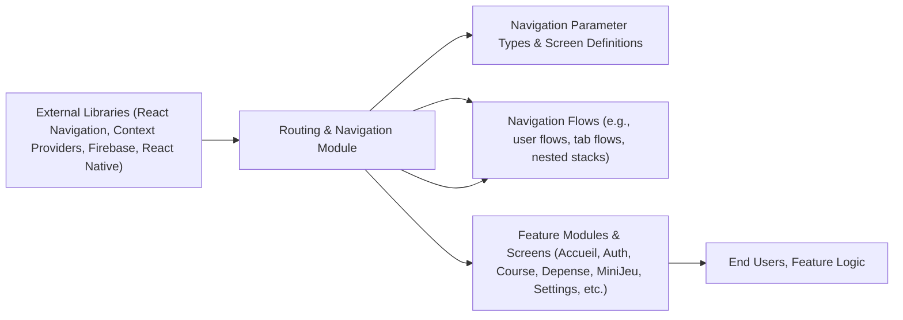

# Application Routing & Navigation

## Overview
The routing module is the backbone of navigation in the MyColoc application. It defines the screen hierarchy, manages user navigation flows, and connects feature modules via stacks and tab navigators. By centralizing navigation logic, this module ensures that users move seamlessly between authentication, main features (shopping, expenses, games), and multiple sub-features. 

## Key Features

- **Central Navigation Orchestration**:  
  Coordinates all navigation flows across the application by defining a primary stack navigator (`RootStackComponent`). This is the top-level navigation container controlling access to all major areas.
  
- **Main Tab Navigation**:  
  Utilizes a bottom tab navigator (`MainStackComponent`) to provide simultaneous access to main feature areas like Home (Accueil), Shopping List, Tasks, and Expenses, each with its own dedicated stack/subworkflow.

- **Sub-feature Stack Navigation**:  
  Each major app section (Accueil, Course, Depense, MiniJeu, Settings, Auth, NoColoc) is isolated in its own stack navigator for encapsulated and manageable flows. This modular approach enables isolated navigation and persistent context within each domain.

- **Contextual Providers for Features**:  
  For screens needing shared data, such as Colocations, Expenses, Mini-Games, and Shopping Lists, navigation stacks are wrapped in relevant context providers, making state management transparent and seamless as users navigate.

- **Screen Parameterization & Nested Navigation**:  
  Allows screens to receive parameters via navigation (e.g., passing an index, selecting a game state), supporting personalized and dynamic navigation experiences.

## System Errors

- **Invalid Navigation State**:  
  _Description:_ Occurs if parameters for required screens are missing or mis-typed, which may cause white screens or stuck navigation.  
  _Resolution:_ Always use provided navigator types (e.g., `RootStackParams`) and screen names. Test navigation flows with all stack parameters.
  
- **Context Not Found**:  
  _Description:_ When a component tries to access context (e.g., `UserContext`, `DepenseContext`) outside the provider tree.  
  _Resolution:_ Ensure screens are only rendered within their designated providers; follow the module's stack/component structure; do not re-organize screens arbitrarily.

- **Keyboard/Tab bar Overlap on Android**:  
  _Description:_ On some devices, the bottom tab bar may incorrectly overlay the keyboard, impacting form usability.  
  _Resolution:_ The `tabBarHideOnKeyboard` and responsive styling options are in place, but verify layouts on both iOS and Android for edge cases.

## Usage Examples

```tsx
// Navigating to the Shopping List screen from elsewhere in the app
navigation.navigate('CourseStack', {
  screen: 'ListeDeCourse',
  params: { index: 'item123' },
});

// Navigating to a mini-game within the MiniJeu stack
navigation.navigate('MiniJeuStack', {
  screen: 'IncognitoSetUp',
  params: { fromRevealRole: true }
});

// Example: Using context within a stack (Depenses)
const [transactions, setTransactions] = useContext(DepenseContext);
// Use or update transactions here...
```

## System Integration


