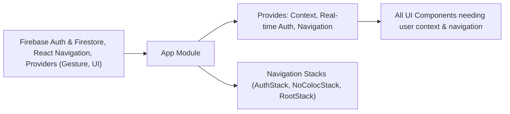

# App Module

## Overview
The `App` module of MyColoc acts as the main entry point and orchestrator for the mobile application. It manages the authentication state, determines the user context, and dynamically routes users to the appropriate navigation flow depending on whether they're authenticated and part of a group (colocation). This module also integrates with core providers and system-wide contexts necessary for the app's user experience.

## Key Features

- **Authentication State Management**: Observes changes from Firebase Authentication. Automatically adapts UI and context to reflect whether users are logged in or not.
- **User Context Provisioning**: Supplies a global UserContext throughout the app, enabling components to access real-time user profile details and preferences.
- **Dynamic Navigation**: Routes users to different navigation stacks based on their group (coloc) participation:
  - Authenticated and in a coloc: sent to the main app experience (`RootStackComponent`)
  - Authenticated but not in a coloc: sent to onboarding/creation flow (`NoColocStackComponent`)
  - Not authenticated: sent to login/sign-up flow (`AuthStackComponent`)
- **Real-time User Profile Sync**: Listens to Firestore updates on user profile documents and instantly refreshes the context and UI when the user’s record changes.
- **Provider Integration**: Wraps app content with gesture handlers and bottom sheet modal provider, ensuring gesture/navigation consistency across all screens.

## System Errors

- **Authentication Errors**: If Firebase authentication fails or if there's an issue initializing the authentication observer, users remain unauthenticated and only see the AuthStack.
  - **Resolution**: Ensure stable internet connection and valid Firebase configuration.
- **User Profile Sync Failure**: Firestore document might not be accessible (network loss, permission issues), resulting in `userInfo` being null and routing user to the Auth or Onboarding flow.
  - **Resolution**: Check Firebase rules and device network connectivity.
- **Context Propagation Issues**: Malfunctioning UserContext or React state inconsistencies can cause blank screens or improper navigation.
  - **Resolution**: Ensure the latest versions of dependencies and confirm that no other component overrides UserContext in the tree.

## Usage Examples

```jsx
// Main application entry (App.js or App.tsx)
import App from './App';

export default function Main() {
  return <App />;
}

// Accessing user profile inside a child component
import { useContext } from 'react';
import { UserContext } from '../UserContext';

function ProfileDisplay() {
  const [userInfo] = useContext(UserContext);
  if (!userInfo) return <Text>Please log in.</Text>;
  return <Text>Welcome, {userInfo.displayName}!</Text>;
}
```

## System Integration


