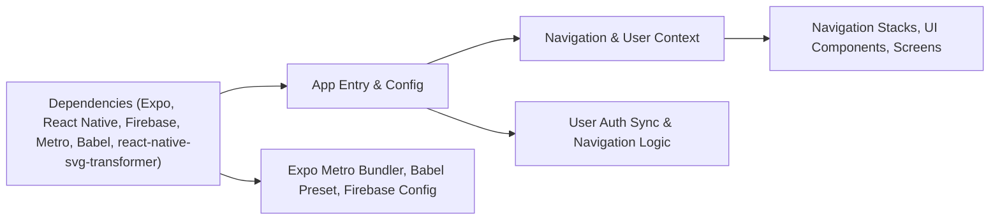

# Getting Started

## Overview
This starter module sets up the foundational environment and entry point for the MyColoc mobile application, a React Native app utilizing Expo. It provides the initialization logic, core provider configuration, navigation setup, and development tooling integrations to quickly get the app running on supported devices and platforms.

## Key Features

- **App Initialization**: Sets up the root context, navigation providers, and wrapper components necessary for the app runtime.
- **User Authentication Sync**: Listens for authentication state changes through Firebase and updates the user context reactively.
- **Navigation Flow Management**: Dynamically chooses and renders the correct navigation stack based on user and account state (authenticated, joined a coloc, etc.).
- **Context Provisioning**: Provides a centralized React context for user data, accessible throughout the app.
- **Integrated Development Environment**: Ready-to-use with Expo, including platform-optimized Metro bundler and Babel configuration.
- **SVG Asset Handling**: Supports seamless usage of SVG assets in the application through Metro and Babel config adjustments.

## System Errors

- **Auth State Sync Issues**: If the Firebase authentication state is not synchronized, users may not be routed correctly.  
  _Resolution_: Ensure Firebase config (`firebaseconfig.js`) is valid and network connectivity is present.
- **Navigation Not Rendering**: If no content is rendered, likely neither authentication nor navigation states are resolved.  
  _Resolution_: Verify the user context logic and check for exceptions in the JS console.
- **SVG Import/Asset Loading Error**: Occurs if Metro or Babel config omits the necessary SVG transformer.  
  _Resolution_: Confirm that both `metro.config.js` and `babel.config.js` include `react-native-svg-transformer`.

## Usage Examples

```jsx
// To start the app with Expo (after installing dependencies)
$ npm install
$ npm start

// App.tsx entry point initializes context and navigation
import App from './App';
// In index.js
import { registerRootComponent } from 'expo';
registerRootComponent(App);

// In App.tsx, navigation adjusts based on user context
if (userInfo) {
  // If user joined coloc
  if (!(userInfo.colocID == "0")) {
    return <RootStackComponent />;
  } else {
    return <NoColocStackComponent />;
  }
} else {
  // Not authenticated
  return <AuthStackComponent />;
}
```

## System Integration


